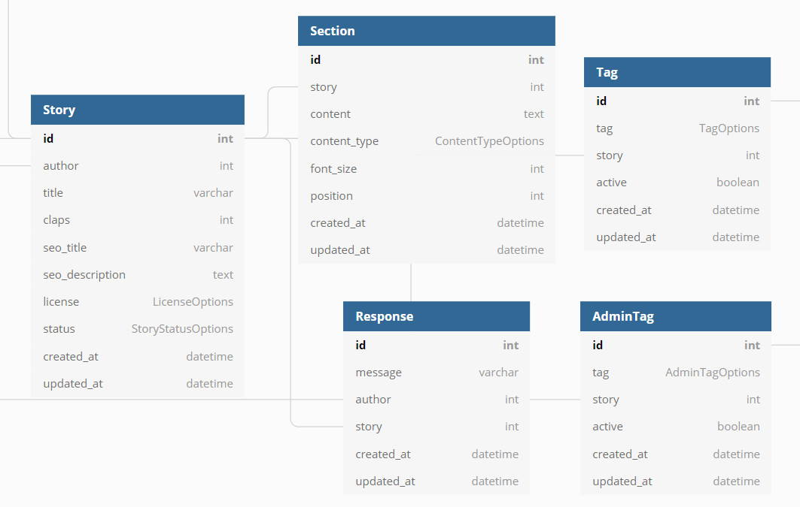
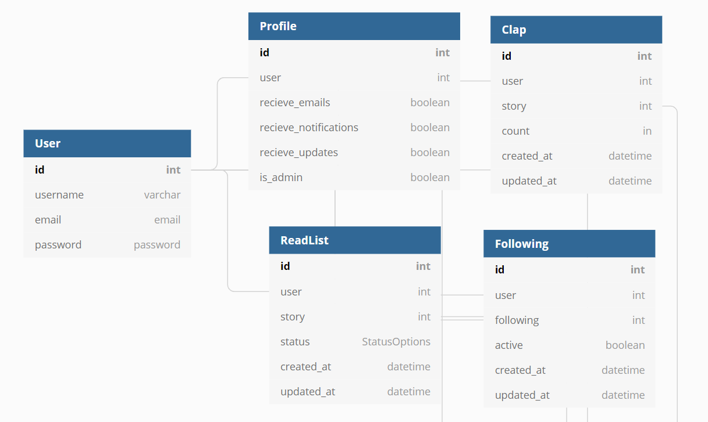
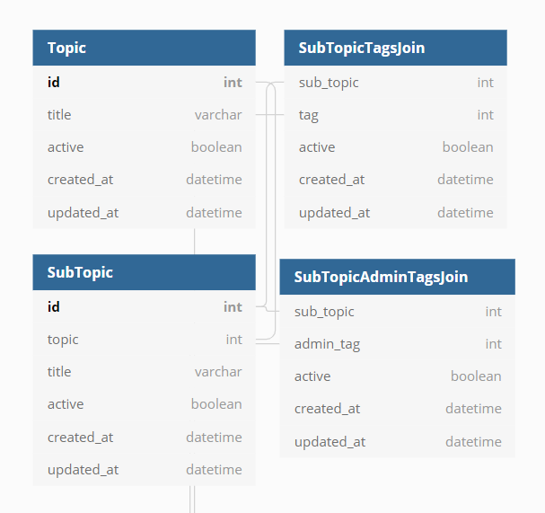

A clone of [towardsdatascience.com](https://towardsdatascience.com/)

# Planning

## Functionality (backend-related)

### Stories App

Users can read stories

API requirements

- get story by title (with associated sections, tags, claps, and author) 
- get the number of responses to the story
- allow reader to follow the author

API requirements
- 

Users can...
- create new stories and save them as draft
- create new stories and publish them
- publish draft stories
- edit published stories
- delete stories
- add tags to stories
- remove tags from stories

Stories can include...
- titles
- text
- images
- quotes
- gifs

Users can...
- set SEO title
- change SEO title
- set SEO description
- change SEO description

Users can...
- write responses
- edit responses

Admin can...
- add admin tags to stories
- remove admin tags to stories

<strong>Profiles App</strong>

Users can...
- create an account
- log in
- log out
- update account details
- update profile details
- delete account

Users can...
- clap for stories 
- follow other users
- unfollow other users
- save story as 'saved'
- save story as 'archived'

Users can...
- view list of 'saved' stories
- view lsit of 'archived stories'
- view list of 'recently viewed' stories
- view list of clapped stories
- view list of who they're following
- view list of who's following them

<strong>Topics App</strong>

Admin can...
- create topics
- edit topics
- delete topic

Admin can...
- add subtopics to topics (by tags)
- add subtopics to topics (via admin tags)
- edit subtopics
- remove subtopics from topics

Users can...
- view topics and subtopics
- view stories of users they're following
- view stories under a subtopic
- search for stories by tag

## Database Architecture
<strong>Stories App</strong>

<strong>Profiles App</strong>

<strong>Topics App</strong>

