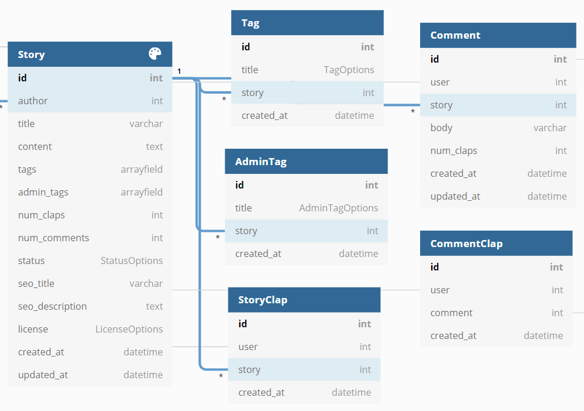
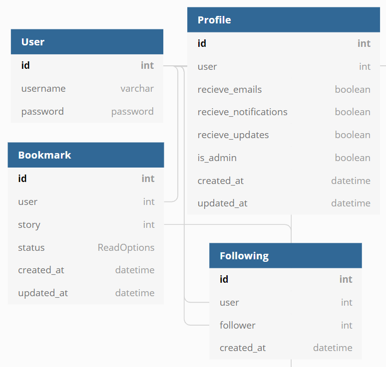

A clone of [towardsdatascience.com](https://towardsdatascience.com/)

TDS is a content sharing website that allows users to publish stories for other users to read.

# Planning
Notes on planning:
- Development is an itterative process. Don't try to plan for the entire application. Applications don't get built in one go - features keep getting added on as time passes by. A good architecture is one that facilitates this continuous development process. 

## MVP Main Entities (django apps)

- <strong>Stories</strong>: Stories are at the center of this application. The main purpose of TDS is to enable people to publish and read stories. 

- <strong>Users</strong>: This application relies on users to publish and access content.

- <strong>Collections</strong>: Collections are groupings of simiar stories. Admin users can create and manage collections to make it easier for users to access stories that that are relevant to them.

## Stories App

|  Functionality  | Implementation  |
|  :--------------------------  |  :--------------------------  |
|  Users can CRUD stories  |  <strong>Stories Table</strong>  |
|  Story contents can include, titles, text, links, images, quotes  |  Store content with htlm tags as string  |
|  Reading a story will return tags and admin_tags  |  Include tags and admin_tags in Stories Table  |
|  Reading a story will return num_claps and num_responses  |  Include num_claps and num_responses in Stories Table  |
|  Users can clap one or more times for each story  |  <strong>StoryClaps Table</strong>  |
|  Authors can add/remove tags to stories  |  <strong>Tags Table</strong>, plus a tags column in stories for efficient retrieval  |
|  Admin can add/remove admin tags to stories  |  <strong>AdminTags Table</strong> retrieval  |
|  Authors can save stories as draft  |  Add status column to Stories Table  |
|  Authors can change SEO settings for stories  |  Add SEO columns to Stories Table  |
|  Authors can change licensing settings for stories  |  Add licensing columns to Stories Table  |
|  Authors can change send free link to story  |  Add free link column to Stories Table  |
|  Users can search for stories  |  Search will be enabled via tags, and ranked via num_claps or date_created  |
|  Users can CRUD a responses to stories  |   <strong>Responses Table</strong>  |
|  Users can clap one or more times for each response  |  <strong>ResponseClaps Table</strong>  |
|  Reading a response will return num_claps  |  Include num_claps in Responses Table  |

#### Stories-related Tables

## Profiles App

|  Functionality  | Implementation  |
|  :--------------------------  |  :--------------------------  |
|  Every user as a profile table  |  <strong>Profiles</strong>table  |
|  Profile is created every time a user is created  |  Set post_save link between User and Profile  |
|  User can change account setting  |  Have settings fields in profile table  |
|  User can view reading history  |  <strong>Bookmarks</strong> table  |
|  User can save or archive stories  |  Have three setting in Bookmarks Table: Read, Saved, Archived  |
|  User can have followers  |  <strong>Following</strong> table  |

## Users App

|  Functionality  | Implementation  |
|  :--------------------------  |  :--------------------------  |
|  User can create a story as saved or published  |  POST /api/stories/  |
|  x  |  x  |
|  x  |  x  |

#### Users-related Tables 

## Collections App

|  Functionality  | Implementation  |
|  :--------------------------  |  :--------------------------  |
|  x  |  x  |
|  x  |  x  |
|  x  |  x  |

#### Collections Tables 

