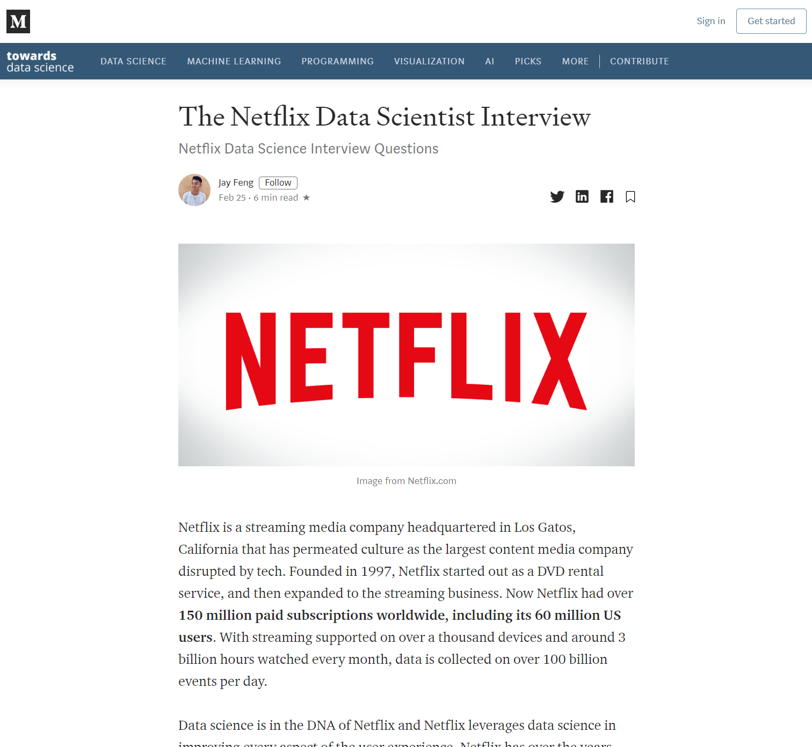
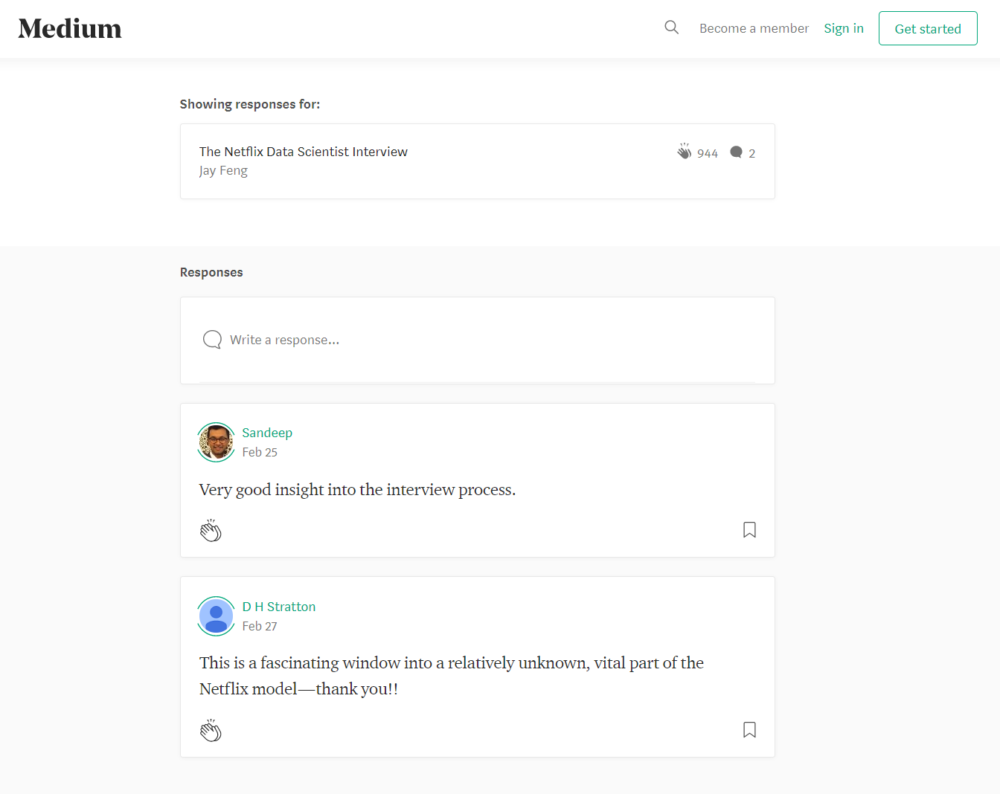

A clone of [towardsdatascience.com](https://towardsdatascience.com/)

TDS is a content sharing website that allows users to publish stories for other users to read.

# Planning
Notes on planning:
- Development is an itterative process. Don't try to plan for the entire application. Applications don't get built in one go - features keep getting added on as time passes by. A good architecture is one that facilitates this continuous development process. 

## MVP Main Entities (django apps)

- <strong>Stories</strong>: Stories are at the center of this application. The main purpose of TDS is to enable people to publish stories 

- <strong>Users</strong>: This application relies on users to publish and access content.

- <strong>Collections</strong>: Collections are groupings of simiar stories. Admin users can create and manage collections to make it easier for users to access stories that that are relevant to them.

## Stories App

|  Functionality  | Implementation  |
|  :--------------------------  |  :--------------------------  |
|  Users can CRUD stories  |  <strong>Stories Table</strong>  |
|  Story contents can include, titles, text, links, images, quotes  |  Store content with htlm tags as string  |
|  Reading a story will return tags and admin_tags  |  Include tags and admin_tags in Stories Table  |
|  Reading a story will return num_claps and num_responses  |  Include num_claps and num_responses in Stories Table  |
|  Users can clap one or more times for each story  |  <strong>StoryClaps Table</strong>  |
|  Authors can add/remove tags to stories  |  <strong>Tags Table</strong>, plus a tags column in stories for efficient retrieval  |
|  Admin can add/remove admin tags to stories  |  <strong>AdminTags Table</strong> retrieval  |
|  Authors can save stories as draft  |  Add status column to Stories Table  |
|  Authors can change SEO settings for stories  |  Add SEO columns to Stories Table  |
|  Authors can change licensing settings for stories  |  Add licensing columns to Stories Table  |
|  Authors can change send free link to story  |  Add free link column to Stories Table  |
|  Users can search for stories  |  Search will be enabled via tags, and ranked via num_claps or date_created  |
|  Users can CRUD a responses to stories  |   <strong>Responses Table</strong>  |
|  Users can clap one or more times for each response  |  <strong>ResponseClaps Table</strong>  |
|  Reding a cresponse will return num_claps  |  Include num_claps in Responses Table  |

#### Database Design

Users can read stories.

API requirements

- get story by title (with associated sections, tags, claps, and author) 
- get the number of responses to the story
- allow reader to follow the author
- allow user to clap for story

Users can view responses for each story, and write or edit their response.

API requirements
- get responses by story (with associated claps, user)
- allow user to create a response
- allow user to edit their response
- allow user to delete their response

Users can write new stories and publish them. Stories can include titels, text, images, quotes, gifs

Users can saves stories as draft, edit published stories

Users can set and change SEO title and description. Users can also add and remove tags, and delete the whole story.

Admin can...
- add admin tags to stories
- remove admin tags to stories

<strong>Profiles App</strong>

Users can...
- create an account
- log in
- log out
- update account details
- update profile details
- delete account

Users can...
- clap for stories 
- follow other users
- unfollow other users
- save story as 'saved'
- save story as 'archived'

Users can...
- view list of 'saved' stories
- view lsit of 'archived stories'
- view list of 'recently viewed' stories
- view list of clapped stories
- view list of who they're following
- view list of who's following them

<strong>Topics App</strong>

Admin can...
- create topics
- edit topics
- delete topic

Admin can...
- add subtopics to topics (by tags)
- add subtopics to topics (via admin tags)
- edit subtopics
- remove subtopics from topics

Users can...
- view topics and subtopics
- view stories of users they're following
- view stories under a subtopic
- search for stories by tag

## Database Architecture
<strong>Stories App</strong>

<strong>Profiles App</strong>

<strong>Topics App</strong>

